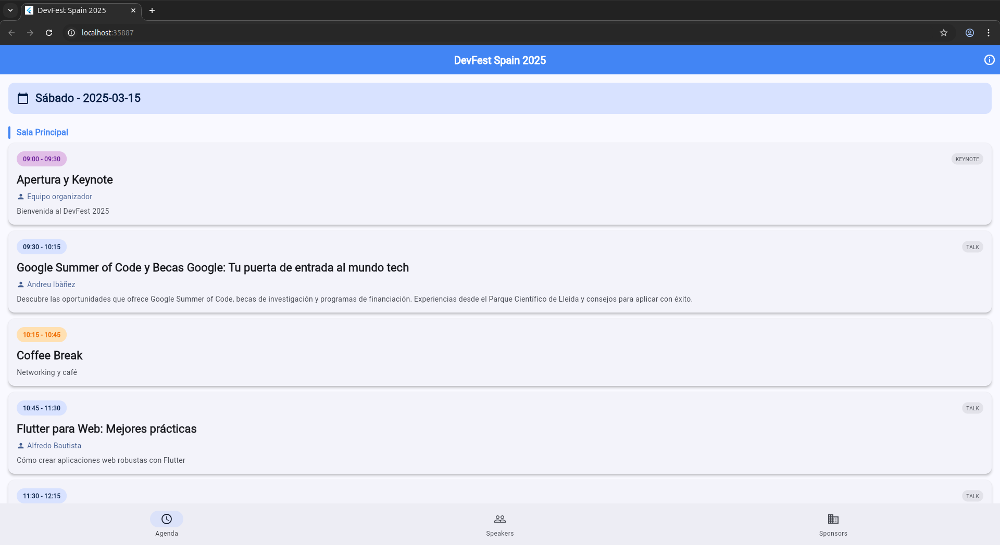

<h1 align="center">
  Simple Event CMS (S.E.C)
</h1>

<p align="center">
  
  
  
</p>

A fully customizable Flutter template for creating professional event websites and apps, deployable on **GitHub Pages** or any static hosting platform. Designed to work without a backend, using a simple **year-based folder structure** and JSON files for content management.



_The template provides a professional interface for event information with responsive design, multi-language support, and comprehensive event management features, as shown above._

## Features

### Core Event Functionality

- **Cross-platform compatibility**: Built with Flutter to run seamlessly on iOS, Android, web, and desktop
- **No backend required**: Content managed through static JSON files hosted on GitHub
- **Year-based structure**: Support for multiple event editions (e.g., 2025, 2026) with easy navigation
- **Professional UI/UX**: Modern Material 3 Design with smooth animations and responsive layouts
- **Multi-environment support**: Development, pre-production, and production configurations
- **GitHub Pages deployment**: Deploy in minutes with automated CI/CD workflows
- **Mobile support**: Flutter apps support Web and mobile applications
- **Location services**: Integrated venue location with coordinates, maps integration, and navigation support for attendees
- **Social media integration**: Built-in social icons and sharing capabilities

### 🌍 Internationalization

- **Full Localization**: Complete support for 8 languages including English, Spanish, Galician, Catalan, Basque, Portuguese, French, and Italian
- **Dynamic Language Switching**: Seamless language changes throughout the app
- **Automatic Detection**: System language detection with intelligent fallbacks
- **Professional Documentation**: Complete English documentation for international developers

For detailed internationalization information, see: **[Internationalization Documentation](INTERNATIONALIZATION.md)**

### 📅 Event Management

- **Multi-day Agenda**: Support for complex event schedules with multiple days, tracks and/or sessions
- **Speaker Profiles**: Comprehensive speaker information with photos and social links
- **Sponsor Management**: Multi-tier sponsor display with logos and descriptions
- **Venue Information**: Complete venue details with location and accessibility information
- **Location Integration**: Users can access venue location with integrated map support and navigation features
- **Session Types**: Support for keynotes, talks, workshops, networking sessions, and more
- **Real-time Updates**: Content updates through GitHub without app redeployment

## App Structure

Event Flutter Template follows Clean Architecture principles with clear separation of concerns across multiple layers. The template is designed for maintainability, testability, and easy customization.

### Architecture Overview

- **Presentation Layer**: UI components, screens, widgets, and state management
- **Core Layer**: Business logic, models, services, and utilities
- **Data Layer**: JSON data loading, configuration management, and external integrations

### Key Components

- **Multi-platform Support**: Flutter-based cross-platform compatibility
- **Static Data Management**: JSON-based content management with GitHub integration
- **Internationalization**: ARB-based localization system with 8 language support
- **Clean Architecture**: SOLID principles with modular design
- **Comprehensive Testing**: Unit, widget, and integration test coverage

For detailed testing documentation, see: **[Testing Documentation](TESTING.md)**

### 🔧 Configuration System

The template features a flexible multi-environment configuration system:

#### Environment Configuration

```dart
// Supported environments with different data sources
enum Environment {
  dev,    // Local development with local JSON files
  pre,    // Pre-production with GitHub raw files
  pro,    // Production with GitHub Pages
}

class ConfigLoader {
  static Environment currentEnvironment = Environment.dev;
  static Map<String, dynamic>? event;
  static String baseUrl = _getBaseUrl();
}
```

#### Data Structure

```dart
// Event configuration model
class event {
  final String eventName;
  final EventDates dates;
  final Venue venue;
  final String description;
  final String? logoUrl;
  final Map<String, String> social;
}

// Agenda structure
class AgendaDay {
  final String date;
  final List<Track> tracks;
}

class Track {
  final String name;
  final List<Session> sessions;
}
```

## 🚀 Getting Started

### Prerequisites

- Flutter SDK 3.0.0 or higher
- Dart SDK 3.0.0 or higher
- Git for version control
- A GitHub account for hosting

### Installation

1. **Clone this repository**

   ```bash
   git clone https://github.com/vicajilau/event_flutter_template.git
   cd event_flutter_template
   ```

2. **Navigate to the code directory**

   ```bash
   cd code
   ```

3. **Install dependencies**

   ```bash
   flutter pub get
   ```

4. **Configure your event data**

   Edit the JSON files in the `2025/` directory:

   - `githubItem/githubItem.json` - github item information

5. **Run the app**

   ```bash
   # Development environment (local files)
   flutter run

   # Pre-production environment (GitHub raw)
   flutter run --dart-define=ENVIRONMENT=pre

   # Production environment (GitHub Pages)
   flutter run --dart-define=ENVIRONMENT=pro
   ```

### Environment Setup

The template supports three environments:

| Environment | Data Source      | Use Case                  |
|-------------|------------------|---------------------------|
| **dev**     | Local files      | Development and testing   |
| **pre**     | GitHub raw files | Pre-production validation |
| **pro**     | GitHub Pages     | Production deployment     |

### Deployment

1. **Configure GitHub Pages**: Enable GitHub Pages in your repository settings
2. **Set up GitHub Actions**: The template includes automated workflows for deployment
3. **Update configuration**: Modify JSON files for your event
4. **Deploy**: Push changes to trigger automatic deployment

## Development and Commands

### Main Commands

- `flutter run`: Run in development mode (local data)
- `flutter run --dart-define=ENVIRONMENT=pre`: Run with GitHub raw data
- `flutter run --dart-define=ENVIRONMENT=pro`: Run with production data
- `flutter test`: Run comprehensive test suite
- `flutter build web`: Build web version for deployment

### Development Workflow

1. **During active development:**

   ```bash
   cd code
   flutter run --hot-reload
   ```

   This enables hot reload for instant code changes.

2. **To test with real data:**

   ```bash
   # Test with pre-production data
   flutter run --dart-define=ENVIRONMENT=pre
   ```

3. **Before committing:**

   ```bash
   flutter analyze          # Check for any issues
   flutter test            # Run all tests
   flutter build web       # Verify web build works
   ```

### Testing

The template includes comprehensive testing to ensure event functionality and internationalization:

- **Unit tests**: Core business logic, data models, and configuration management
- **Widget tests**: UI components, navigation, and user interactions
- **Integration tests**: End-to-end event flow testing
- **Internationalization tests**: Multi-language support validation

```bash
# Run all tests
flutter test

# Run tests with coverage
flutter test --coverage

# Run specific test file
flutter test test/widget_test.dart
```

For detailed testing information, see: **[Testing Documentation](TESTING.md)**

### Customization

The template is fully customizable through JSON configuration files. You can easily modify:

- **Event information**: Name, dates, venue, description
- **Visual theme**: Primary and secondary colors
- **Speakers**: Profiles, bios, social media links
- **Agenda**: Multi-day schedules with tracks and sessions
- **Sponsors**: Different sponsor tiers with logos

For complete configuration instructions including JSON structure, examples, and best practices, see: **[Configuration Guide](CONFIGURATION.md)**

#### Quick Start

1. **Edit event basic info** in `events/2025/config/config.json`
2. **Add your speakers** in `events/2025/speakers/speakers.json`
3. **Configure agenda** in `events/2025/config/agenda.json`
4. **Add sponsors** in `events/2025/sponsors/sponsors.json`

#### Visual Customization

- **Colors**: Update `primaryColor` and `secondaryColor` in events.json
- **Logo**: Replace logo files in assets
- **Icons**: Update social media icons in `lib/ui/widgets/`

## Perfect for

- **Tech conferences**: Complete agenda management with speaker profiles
- **DevFests**: Multi-track support with technical sessions
- **Meetups**: Simple event information with networking features
- **Festivals**: Multi-day events with complex scheduling
- **Hackathons**: Event information with sponsor integration
- **Corporate events**: Professional design with customizable branding

## Contributing

Contributions are welcome! Please follow these steps:

### To Contribute

1. **Fork the repository**
2. **Create a branch for your feature:**

   ```bash
   git checkout -b feature/new-event_collection-feature
   ```

3. **Make changes and test:**

   ```bash
   cd code
   flutter analyze        # Check for any issues
   flutter test          # Verify tests pass
   ```

4. **Test the template:**

   ```bash
   # Test on different platforms
   flutter run -d android
   flutter run -d ios
   flutter run -d chrome
   ```

5. **Commit and push:**

   ```bash
   git add .
   git commit -m "feat: add new event management feature"
   git push origin feature/new-event_collection-feature
   ```

6. **Create Pull Request**

### Conventions

- **Commits**: Use [Conventional Commits](https://www.conventionalcommits.org/)

  - `feat:` for new features (e.g., new event types, UI improvements)
  - `fix:` for bug fixes
  - `docs:` for documentation changes
  - `refactor:` for code refactoring
  - `test:` for adding or modifying tests

- **Code**:
  - Follow Flutter/Dart style guidelines
  - Use meaningful variable and function names
  - Add English comments for complex logic
  - Ensure responsive design for different screen sizes
  - Update tests when adding new features

### Adding New Features

To add new event features:

1. **Create the data model** (`lib/core/models.dart`)
2. **Add UI components** (`lib/ui/`)
3. **Implement data loading** (`lib/core/data_loader.dart`)
4. **Update configuration** (`lib/core/config_loader.dart`)
5. **Add internationalization** (`lib/l10n/`)
6. **Add tests** for the new functionality

## 📚 Documentation

### Core Documentation

- **[Main README](README.md)**: This file - comprehensive overview and setup guide
- **[Configuration Guide](CONFIGURATION.md)**: Complete guide to event configuration, JSON structure, and customization options
- **[Internationalization Documentation](INTERNATIONALIZATION.md)**: Complete guide to multi-language support and localization system
- **[Testing Documentation](TESTING.md)**: Detailed testing guide with coverage information and best practices
- **[License](LICENSE)**: MIT License details and terms

### Key Features Documentation

- **Multi-environment Configuration**: Development, pre-production, and production setups
- **GitHub Integration**: Automated deployment and content management
- **Material 3 Design**: Modern UI with professional appearance
- **Cross-platform Support**: Seamless operation across all Flutter-supported platforms
- **Social Media Integration**: Built-in social sharing and contact features
- **Responsive Design**: Optimized for mobile, tablet, and desktop experiences

### Technical Architecture

- **Clean Architecture**: Separation of concerns with modular design
- **JSON-based Content**: Static content management without backend requirements
- **State Management**: Efficient state handling for event data
- **Localization System**: ARB-based internationalization with 8 language support

### Reporting Issues

If you find a bug or have a suggestion:

1. **Check** that a similar issue doesn't already exist
2. **Create a new issue** with:
   - Clear description of the problem
   - Steps to reproduce
   - Screenshots if applicable
   - Device information (OS, Flutter version)
   - Expected vs actual behavior
   - **For configuration issues**: Include environment and JSON configuration

### Feature Requests

We welcome suggestions for:

- **New event types** and session formats
- **Additional integrations** (calendar, maps, ticketing)
- **Enhanced UI components** (timelines, interactive maps, networking features)
- **Advanced configuration** (themes, branding, custom layouts)
- **New languages** for localization
- **Analytics integration** and performance tracking
- **Accessibility features** and improvements

## License

This project is licensed under the MIT License - see the [LICENSE](LICENSE) file for details.
